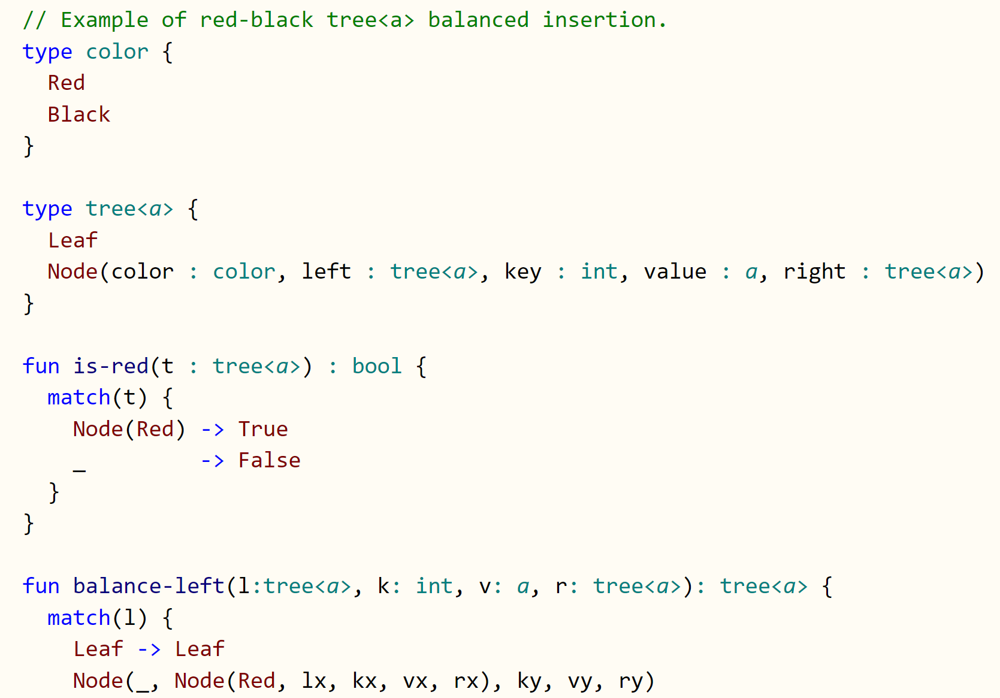

<!--
[](https://travis-ci.org/koka-lang/koka)
-->
[](https://gitter.im/koka-lang/koka?utm_source=badge&utm_medium=badge&utm_campaign=pr-badge&utm_content=badge)

&nbsp;

# Koka: a function-oriented language with effect inference

_Koka v2 is a research language that currently under heavy development with the new C backend_

_Latest release_: v2.0.10, 2020-11-28 ([Install](#install)).

Koka is a strongly typed, strict functional language which tracks the (side) _effects_ of every function in its type.
Koka syntax is Javascript/C like,
the evaluation is strict like OCaml/C, and the type- and effect system is Haskell like, where pure and effectful computations are distinguished.
The precise effect typing gives Koka rock-solid semantics backed by well-studied category theory, which makes Koka particularly easy to reason
about for both humans and compilers. (Given the importance of effect typing, the name Koka was derived from the Japanese word for _effective_ ([Kōka](https://translate.google.com/#view=home&op=translate&sl=auto&tl=en&text=%E5%8A%B9%E6%9E%9C), 効果)).

<a href="https://github.com/koka-lang/koka/tree/master/samples/basic/rbtree.kk"></a>

A function without any effect is called _total_ and corresponds to mathematically total functions -- a good place to be.
Then we have effects for partial functions that can raise exceptions, as _exn_, and potentially non-terminating functions as _div_ (divergent).
The combination of _exn_ and _div_ is called _pure_ as that corresponds to Haskell's notion of purity. On top of that we find
mutability (as _st_) up to full non-deterministic side effects in _io_.

Koka also has full support for _algebraic effect handlers_. This enables powerful control-flow abstraction that allows users to define
compositional control-flow abstractions as a library; this includes advanced abstractions like exceptions, iterators, async-await concurrency,
ambient state, backtracking parser combinators, probablistic programming, Bayesian machine learning, etc. Algebraic effect handlers subsume (free)
monads, and are compositional without needing lifting or monad transformers.

Recent work on [evidence translation](https://www.microsoft.com/en-us/research/uploads/prod/2020/07/evidently-with-proofs-5f0b7d860b387.pdf)
and [Perceus]
precise compiler guided reference counting enable Koka to compile directly
to plain C code _without needing a garbage collector_ or runtime system. Initial performance [benchmarks](#benchmarks) are promising,
and it is our goal to generally fall within a factor 2&times; of C++ performance without needing manual memory management.

For more background information, see:

* The [Koka manual][kokabook] for a tour of the Koka language and its specification.
* The [library documentation][libraries].
* The article _Algebraic Effects for Functional Programming_ [[3]](#references) about the algebraic effects in Koka.

[kokabook]: https://koka-lang.github.io/koka/doc/kokaspec.html  
[tour]: https://koka-lang.github.io/koka/doc/kokaspec.html#tour
[libraries]: https://koka-lang.github.io/koka/doc/toc.html
[slides]: http://research.microsoft.com/en-us/projects/koka/2012-overviewkoka.pdf
[kokarepo]: https://github.com/koka-lang/koka
[kokaproject]: http://research.microsoft.com/en-us/projects/koka

[releases]: https://github.com/koka-lang/koka/releases
[build]: #build-from-source
[Perceus]: https://www.microsoft.com/en-us/research/uploads/prod/2020/11/perceus-tr-v1.pdf
[vsprompt]: https://docs.microsoft.com/en-us/cpp/build/how-to-enable-a-64-bit-visual-cpp-toolset-on-the-command-line?view=vs-2019

Enjoy,
  Daan Leijen

Special thanks to:
- [Ningning Xie](https://xnning.github.io/) for her work on the theory and practice of evidence translation [[6]](#references) and the formalization of Perceus reference counting [[8]](#references).
- [Alex Reinking](https://alexreinking.com/) for the implementation of the Perceus reference counting analysis [[8]](#references).
- And all previous interns working on earlier versions of Koka: Daniel Hillerström, Jonathan Brachthäuser, Niki Vazou, Ross Tate, Edsko de Vries, and Dana Xu.

Releases:
- `v2.0.10`, 2020-11-28: syntax highlighting support for Visual Studio Code and Atom.
- `v2.0.9`, 2020-11-27: now with binary [releases] for Windows, macOS, and Linux.
- `v2.0.7`, 2020-11-23: more small fixes, improved scoped handlers, improved higher-rank type propagation, more samples.
- `v2.0.5`, 2020-11-15: many bug fixes and improvements. Improved codegen, named handlers, added samples, docker support, direct C compilation, local install support.
- `v2.0.0`, 2020-08-21: initial v2 release.


# Install

For Linux and macOS on x86 64-bit, you can install Koka using:
````
> curl -sSL https://github.com/koka-lang/koka/releases/latest/download/install.sh | sh
````
This also installs syntax highlighting for the VS Code and Atom editors.
After installation, verify if Koka installed correctly:
````
> koka
 _          _           ____
| |        | |         |__  \
| | __ ___ | | __ __ _  __) |
| |/ // _ \| |/ // _` || ___/ welcome to the koka interpreter
|   <| (_) |   <| (_| ||____| version 2.0.10, Nov 28 2020, libc 64-bit (gcc)
|_|\_\\___/|_|\_\\__,_|       type :? for help

loading: std/core
loading: std/core/types
loading: std/core/hnd
````

Type ``:q`` to exit the interpreter.

For detailed instructions and other platforms (including Windows) see the [releases] page.
It is also straightforward to build the compiler [from source][build].

## Running the compiler

You can compile a Koka source using `-c` (note that all [`samples`](https://github.com/koka-lang/koka/tree/master/samples) are pre-installed):

    > koka -c samples/basic/caesar.kk
    compile: samples/basic/caesar.kk
    loading: std/core
    loading: std/core/types
    loading: std/core/hnd
    loading: std/num/double
    loading: std/text/parse
    loading: std/num/int32
    check  : samples/basic/caesar
    linking: samples_basic_caesar
    created: out/v2.0.9/gcc-debug/samples_basic_caesar

and run the resulting executable:

    > out/v2.0.9/gcc-debug/samples_basic_caesar
    plain  : Koka is a well-typed language
    encoded: Krnd lv d zhoo-wbshg odqjxdjh
    cracked: Koka is a well-typed language


The ``-O2`` flag builds an optimized program. Let's try it on a functional implementation
of balanced insertion in a red-black tree ([`rbtree.kk`](https://github.com/koka-lang/koka/tree/master/test/bench/koka/rbtree.kk))
(the following two examples are only available if you checked out the Koka source):

    > koka -O2 -c test/bench/koka/rbtree.kk
    ...
    linking: test_bench_koka_rbtree
    created: out/v2.0.9/gcc-drelease/test_bench_koka_rbtree

    > time out/v2.0.9/gcc-drelease/test_bench_koka_rbtree
    420000
    real    0m0.680s
    ...

We can compare this against an in-place updating C++ implementation using ``stl::map``
([``rbtree.cpp``](https://github.com/koka-lang/koka/tree/master/test/bench/cpp/rbtree.cpp)) (which uses the
[``tree.cc``](https://code.woboq.org/gcc/libstdc++-v3/src/c++98/tree.cc.html) implementation internally):

    > g++ --std=c++17 -o cpp_rbtree -O3 test/bench/cpp/rbtree.cpp
    > time ./cpp_rbtree
    420000
    real    0m0.916s
    ...

The excellent performance relative to C++ here (on an AMD 3600XT) is the result of Perceus automatically
transforming the fast path of the pure functional rebalancing to use mostly in-place updates,
closely mimicking the imperative rebalancing code of the hand optimized C++ library.

## Running the interactive compiler

Without giving any input files, the interactive interpreter runs by default:
````
> koka
 _          _           ____
| |        | |         |__  \
| | __ ___ | | __ __ _  __) |
| |/ // _ \| |/ // _` || ___/ welcome to the koka interpreter
|   <| (_) |   <| (_| ||____| version 2.0.9, Nov 27 2020, libc 64-bit (gcc)
|_|\_\\___/|_|\_\\__,_|       type :? for help

loading: std/core
loading: std/core/types
loading: std/core/hnd
>
````

Now you can test some expressions:

    > println("hi koka")
    check  : interactive
    check  : interactive
    linking: interactive
    created: out\v2.0.9\mingw-debug\interactive

    hi koka

    > :t "hi"
    string

    > :t println("hi")
    console ()

Or load a demo (use ``tab`` completion to avoid typing too much):

    > :l samples/basic/fibonacci
    compile: samples/basic/fibonacci.kk
    loading: std/core
    loading: std/core/types
    loading: std/core/hnd
    check  : samples/basic/fibonacci
    modules:
      samples/basic/fibonacci

    > main()
    check  : interactive
    check  : interactive
    linking: interactive
    created: out\v2.0.9\mingw-debug\interactive

    The 10000th fibonacci number is 33644764876431783266621612005107543310302148460680063906564769974680081442166662368155595513633734025582065332680836159373734790483865268263040892463056431887354544369559827491606602099884183933864652731300088830269235673613135117579297437854413752130520504347701602264758318906527890855154366159582987279682987510631200575428783453215515103870818298969791613127856265033195487140214287532698187962046936097879900350962302291026368131493195275630227837628441540360584402572114334961180023091208287046088923962328835461505776583271252546093591128203925285393434620904245248929403901706233888991085841065183173360437470737908552631764325733993712871937587746897479926305837065742830161637408969178426378624212835258112820516370298089332099905707920064367426202389783111470054074998459250360633560933883831923386783056136435351892133279732908133732642652633989763922723407882928177953580570993691049175470808931841056146322338217465637321248226383092103297701648054726243842374862411453093812206564914032751086643394517512161526545361333111314042436854805106765843493523836959653428071768775328348234345557366719731392746273629108210679280784718035329131176778924659089938635459327894523777674406192240337638674004021330343297496902028328145933418826817683893072003634795623117103101291953169794607632737589253530772552375943788434504067715555779056450443016640119462580972216729758615026968443146952034614932291105970676243268515992834709891284706740862008587135016260312071903172086094081298321581077282076353186624611278245537208532365305775956430072517744315051539600905168603220349163222640885248852433158051534849622434848299380905070483482449327453732624567755879089187190803662058009594743150052402532709746995318770724376825907419939632265984147498193609285223945039707165443156421328157688908058783183404917434556270520223564846495196112460268313970975069382648706613264507665074611512677522748621598642530711298441182622661057163515069260029861704945425047491378115154139941550671256271197133252763631939606902895650288268608362241082050562430701794976171121233066073310059947366875

And quit the interpreter:

    > :q

    I think of my body as a side effect of my mind.
      -- Carrie Fisher (1956)

The ``samples/syntax`` and ``samples/basic`` directories contain various basic Koka examples to start with. If you type:

    > :l samples/

in the interpreter, you can ``tab`` twice to see the available sample files and directories.
Use ``:s`` to see the source of a loaded module.


## Algebraic effect handlers

A novel feature of Koka is a compiled and typed implementation of algebraic
effect handlers (described in detail in [[3]](#references)).
In the interactive environment, you can load various demo files with algebraic
effects which are located in the ``samples/handlers`` directory.

    > :f samples/handlers/basic

where ``:f`` forces a recompile (versus ``:l`` which avoids a recompile if possible).
Use the ``:?`` command to get an overview of all commands. After
loading the ``common`` demo, we can run it directly from the interpreter:

    > :f samples/handlers/basic
    compile: samples/handlers/basic.kk
    ...
    check  : samples/handlers/basic
    modules:
      samples/handlers/basic

    > :t test2    
    () -> console ()

    > test2()
    check  : interactive
    check  : interactive
    linking: interactive
    created: out\v2.0.5\mingw-debug\interactive

    Hello there, there

Some interesting demos are:

* ``basic.kk``: Various examples from the paper "_Algebraic Effects for
  Functional Programming_" [[3]](#references). Shows how to implement
  common control-flow abstractions like exceptions, state, iterators,
  ambiguity, and asynchronous programming.

* ``nim.kk``: Various examples from the paper "_Liberating effects with
  rows and handlers_" [[1]](#references).

* ``scoped.kk``: Examples from the paper "_Effect Handlers in Scope_" [[5]](#references).


## What next?

* Read a [Tour of Koka][tour] in the Koka manual.
* Check the [library][libraries] documentation.
* Write some cool Koka programs :-)


# Benchmarks

These are initial benchmarks of Koka v2 with [Perceus] reference counting
versus state-of-the-art memory reclamation implementations in
various other languages. Since we compare across languages we need to
interpret these results with care -- the results depend not only on memory
reclamation but also on the different optimizations performed by each
compiler and how well we can translate each benchmark to that particular
language. We view these results therefore mostly as _evidence that the
current Koka implementation of reference counting is viable and can be competitive_
and _not_ as a direct comparison of absolute performance between languages and systems.

As such, we select here only benchmarks that stress memory allocation, and
we tried to select mature comparison systems that use a range of memory
reclamation techniques and are considered best-in-class. The systems we
compare are, Koka 2.0.3 (compiling the generated C code with gcc 9.3.0),
[OCaml](https://ocaml.org) 4.08.1, [Haskell](https://www.haskell.org) GHC 8.6.5,
[Swift](https://swift.org/) 5.3, [Java](https://www.java.com) SE 15.0.1 with the Hotspot G1 collector,
and [C++](http://www.cplusplus.org).


The benchmarks are all available in [`test/bench`](test/bench) (see below for
build instructions), and all
stress memory allocation with little computation:
`rbtree` (inserts 42 million items into a red-black tree),
`rbtree-ck` (a variant of `rbtree` that keeps a list of every 5th
subtree and thus shares many subtrees), `deriv`
(the symbolic derivative of a large expression),
`nqueens` (calculates all solutions for the n-queens problem of size 13
into a list, and returns the length of that list where the solution lists
share many sub-solutions), and `cfold` (constant-folding over a large symbolic expression).

Note: in C++, without automatic memory management, many benchmarks are
difficult to express directly as they use persistent and
partially shared data structures. To implement these faithfully would
essentially require manual reference counting. Instead, we use C++ as
our performance baseline: we either use in-place updates
without supporting persistence (as in `rbtree` which uses ``std::map``)
or we do not reclaim memory at all (as in `deriv`, `nqueens`, and `cfold`).

The execution times and peak working set averaged over 10 runs and normalized to Koka are in
the figure on the right (on a 3.8Ghz AMD3600XT on Ubuntu 20.04, Nov 2020).

We can see that even though Koka has currently few
optimizations besides the reference counting ones, it performs very well
compared to these mature systems, often outperforming by a significant
margin -- both in execution time and peak working set.
Clearly, these benchmarks are allocation heavy but it is encouraging
to see this initial performance from Koka.

A full discussion of these benchmarks and systems can be found
in the [Perceus] report.


# Build from source

Koka has few dependencies and should build from source
without problems on most common platforms, e.g. Windows (including WSL), macOS X, and
Unix. The following programs are required to build Koka:

* [Stack](https://docs.haskellstack.org/) to run the Haskell compiler.  
  (use `> curl -sSL https://get.haskellstack.org/ | sh` on Unix and macOS X)
* [CMake](https://cmake.org/download/) to compile the Koka C support library.  
  (use `> sudo apt-get install cmake` on Ubuntu, `> brew install cmake` on macOS X).
* Optional: the [NodeJS](http://nodejs.org) runtime if using the Javascript backend.
* On Windows you need [Visual Studio](https://visualstudio.microsoft.com/downloads/) (for the windows SDK).

Build the compiler (note the `--recursive` flag):
```
> git clone --recursive https://github.com/koka-lang/koka
> cd koka
> stack build
> stack exec koka
```
You can also use `stack build --fast` to build a debug version of the compiler.

## Source install

You can also build a local distribution bundle yourself from source and install
that locally. The `util/bundle.kk` script creates a local distribution:
```
> stack exec koka -- util/bundle
...
distribution bundle created.
  bundle : dist/koka-v2.0.9-linux-amd64.tar.gz
  cc     : gcc
  version: v2.0.9
```
This takes a while as it pre-compiles the standard libraries in three build
variants (`debug`, `drelease` (release with debug info), and `release`).
After generating the bundle, it can be installed locally as:
```
> util/install.sh -b dist/koka-v2.0.9-linux-amd64.tar.gz
```
(use `util/install.bat` on Windows). After installation, you can now directly invoke `koka`:

```
> koka --version
```
Koka is by default installed for the current user in `<prefix>/bin/koka`,
(with architecture specific files under `<prefix>/lib/koka/v2.x.x`
and libraries and samples under `<prefix>/share/koka/v2.x.x`).

## Source install on Windows

On Windows, the default install is to the userprofile `%APPDATA%\local` which
is usually already on the search path as `stack` is installed there as well.
However, when using `koka` you need to have a C compiler (when
using `stack exec koka` the C compiler supplied with `ghc` is used (`mingw`)
but that is not generally available).

Generally, you need to install and run `koka` from a
[Visual Studio x64 toolset](vsprompt) command prompt.
in order to link correctly with the Windows system libraries.
Koka can use either the `cl` compiler (default), or the [`clang-cl`](https://releases.llvm.org/download.html) compiler
(use the `--cc=clang-cl` option with Koka).
To bundle for a specific compiler, use this flag when running `util/bundle` as well (from a VS command prompt):
```
> stack exec koka -- --cc=clang-cl util/bundle
```
or
```
> stack exec koka -- --cc=cl util/bundle
```

Generally, for Koka code, `mingw` (`gcc`) optimizes best, closely followed `clang-cl`.
On a 3.8Gz AMD 3600XT, with `mingw` 7.2.0, `clang-cl` 11.0.0, and `cl` 19.28 we get:
```
> stack exec out\v2.0.5\mingw-release\test_bench_koka_rbtree -- --kktime
420000
info: elapsed: 0.624s, user: 0.625s, sys: 0.000s, rss: 163mb

> out\v2.0.5\clang-cl-release\test_bench_koka_rbtree --kktime
420000
info: elapsed: 0.727s, user: 0.734s, sys: 0.000s, rss: 164mb

> out\v2.0.5\cl-release\test_bench_koka_rbtree --kktime
420000
info: elapsed: 1.483s, user: 1.484s, sys: 0.000s, rss: 164mb
```

## Build and run benchmarks

There is a standard benchmark suite (discussed in detail in [Perceus] paper).
It is still basic but more benchmarks
with effect handlers are coming. The suite can run on (Ubuntu Linux), WSL2, and macOSX,
and the benchmarks need:

- `gcc`. Should be there, otherwise use `sudo apt install gcc`,
- `ghc`. Use `sudo apt install ghc`,
- `ocamlopt`. Use `sudo apt install ocaml`,
- `swiftc`. The Swift compiler can be downloaded [here](https://swift.org/download/).
   The benchmarks expect `swiftc` to be installed at `/opt/swift/bin`,
   so unpack and copy everything under `swift-.../usr` to `/opt/swift/bin`:
   ```
   > tar -xzf swift-5.3-RELEASE-ubuntu20.04.tar.gz
   > cd swift-5.3-RELEASE-ubuntu20.04/usr
   > sudo mkdir /opt/swift
   > sudo cp -r * /opt/swift
   ```
- `javac`/`java`. We used these [instructions](https://computingforgeeks.com/install-oracle-java-openjdk-14-on-ubuntu-debian-linux/)
   to install the Java SE 15 Hotspot compiler:
   ```
   > sudo apt update
   > sudo add-apt-repository ppa:linuxuprising/java
   > sudo apt -y install oracle-java15-installer
   > sudo apt -y install oracle-java15-set-default
   > java --version
   java 15.0.1 2020-10-20
   Java(TM) SE Runtime Environment (build 15.0.1+9-18)
   Java HotSpot(TM) 64-Bit Server VM (build 15.0.1+9-18, mixed mode, sharing)
   ```

The benchmarks can now be build using:

```
> cd test/bench
> mkdir build
> cd build
> cmake .. -DCMAKE_BUILD_TYPE=Release
> cmake --build .
```

For some benchmarks, like `cfold`, we may need a large stack, so it may be good to raise the limit:
```
> ulimit -s unlimited
```

We can then run all benchmarks as:
```
> ctest .
```
Or only run benchmarks for one language with `-L <lang>`:
```
> ctest -L koka
```
Or run specific benchmarks using `-R <regex>`,
like the symbolic derivative benchmark:
```
> ctest -R deriv      
Test project /home/daan/dev/koka/test/bench/build
    Start  4: hs-deriv
1/4 Test  #4: hs-deriv .........................   Passed    2.29 sec
    Start 10: kk-deriv
2/4 Test #10: kk-deriv .........................   Passed    1.25 sec
    Start 19: ml-deriv
3/4 Test #19: ml-deriv .........................   Passed    1.73 sec
    Start 25: sw-deriv
4/4 Test #25: sw-deriv .........................   Passed    2.88 sec

100% tests passed, 0 tests failed out of 4
...
```

We can also run the tests using the `test/bench/run.kk` script instead of
using `ctest` which also measures peak working set and calculates
normalized scores. For example, from the `build` directory, we can run all benchmarks as:
```
> koka ../run
```
Use the `--lang` or `--test` options to specify a comma separated list of
languages or benchmarks:
```
> koka ../run -- --lang=koka,ocaml  --test=rbtree,rbtree-ck
```
The `-i<N>` switch runs `N` iterations on each benchmark and calculates
the average and the error interval.


## Testing

To run tests, use stack:

```
> stack test                                              # All tests
> stack test --test-arguments="--match /parc/"            # One category
> stack test --test-arguments="--mode new"                # Create output files
> stack test --test-arguments="--mode update"             # Update output files
> stack test --test-arguments="--match /parc/ --mode new" # Combined
```

<!--
# Evidence Translation and Perceus

Koka compiles directly to plain C code without needing a garbage collector or runtime system.
There are two crucial ingredients to make this possible: evidence translation and Perceus.

## Evidence translation

As described in the paper _Effect Handlers, Evidently_, Xie _et al._ [[6]](#references) show how to translate algebraic effect handlers at compilation
time down to pure lambda calculus where all control flow is explicit again. This is done by Koka to remove any dependence on
runtime mechanisms like split-stacks (as in Multi-core OCaml) or C stack copying [[7]](#references). Moreover, as the evidence for each handler
is passed down to the call site, all _tail-resumptive_ operations can be executed in-place without needing to do an expensive
yield- and resume. This makes the cost of tail-resumptive operations on effects comparable to a virtual method call.

## Perceus

Even a purely functional core intermediate language with explicit control flow is not yet enough to compile to C directly: without manual memory
management functional languages still need a (tracing) garbage collector (like OCaml or Haskell). A well performing concurrent generational
garbage collector is very hard to build and is invasive as it needs to be able to scan the roots and stack. Even the best garbage collectors
still suffer from unpredictable latencies (especially with large live sets) and tend to require (much) more memory than achievable with
manual memory management (as with C/C++ and Rust).

With Koka we took a novel approach based on reference counting. The usual wisdom is that  reference counting does not perform well due to various factors but
in Koka we believe we can do better: 1) we know that all inductive and co-inductive datatypes are never cyclic so we can identify potential cycle introducing
datatypes statically (like mutable references, and these are not so often used in mostly functional Koka), 2) again due to the strict type system
we can statically track which values may become shared across threads and avoid expensive atomic operations for the majority of operations, and
finally 3) due to the explicit control-flow we can do deep analysis on variable life times.

In particular, we use aggressive static analysis to insert _precise_ reference count instructions where memory is freed as soon as
it is no longer live. We call this _garbage free_ reference counting. In particular, we do not hold on to memory based on
lexical scope as in almost all reference counting implementations in the wild, like Swift, Nim, Python, C++ with `shared_ptr`, Rust with `Rc<T>` etc).

[Perceus](https://www.microsoft.com/en-us/research/uploads/prod/2020/11/perceus-tr-v1.pdf) stands
for _Precise automatic reference counting with reuse and specialization_: the _reuse_ component transform functional style pattern matches
into _in-place update_ when possible, while _specialization_ specialize the reference counting based on the call sites and
removes most rc operations in the fast path. For example, a simple `map` function:
```koka
fun map( xs : list<a>, f : a -> e b ) : e list<b> {
  match(xs) {
    Cons(x,xx) -> Cons( f(x), map(xx,f) )
    Nil        -> Nil
  }
}
```
will update the list _in place_ (reusing the `Cons` nodes that are matched) if the list happens to be not shared (and makes a copy otherwise).
This dynamically adjust the program from in-place update to persistence and is the main reason why it can approach the performance of
hand-optimized C++ on the balanced tree benchmark.
-->

# Tasks

Please help develop Koka: there are many opportunities to improve Koka or do research with Koka. We need:

- Emacs and Vim syntax highlighting.
- Improve documentation, landing page etc. Make it easier for people to contribute.
- More examples
- Many library modules are incomplete (like `std/os/file`) or missing (like `std/data/map`).

More advanced projects:

- A language server for Visual Studio Code and Atom. Koka can already generate a typed [range map](src/Syntax/RangeMap.hs) so this
  should be managable.
- Package management of Koka modules.a
- Implement inline specialization where functions like `map`, `fold` etc get specialized for the function with which they are called.
  This is an important optimization for functional style languages to reduce the allocation of lambda's.
- Various standard optimizations like case-of-case, join points, case-of-known constructor, etc.
- Borrowing analysis for Perceus.
- Known reference count specialization.

The following is the immediate todo list to be completed in the coming months:

- Port all libray modules, in particular `std/text/regex` (using PCRE), and `std/async` (using `libuv`).
- Run the full test suite again.
- Run the Bayesian probalistic machine learning program with large parameters.
- Improve compilation of local state to use local variables directly (in C).
- Functions with a pattern match in the argument.

Contact me if you are interested in tackling some of these :-)

Main branches:
- `master`: latest stable version.
- `dev`: current development branch -- submit PR's to this branch.
- `v1-master`: last stable version of Koka v1: this is Koka with the Javascript (and C#) backend which does not use evidence translation.
               This version supports `std/async` and should compile examples from published papers.


# References

1. Daniel Hillerström, and Sam Lindley. &ldquo;Liberating Effects with Rows and Handlers.&rdquo; In _Proceedings of the 1st International Workshop on Type-Driven Development_, 15--27. TyDe 2016. Nara, Japan. 2016. doi:[10.1145/2976022.2976033](https://dx.doi.org/10.1145/2976022.2976033).

2. Daan Leijen. &ldquo;Koka: Programming with Row Polymorphic Effect Types.&rdquo; In _Mathematically Structured Functional Programming 2014_. EPTCS. Mar. 2014. arXiv:[1406.2061](http://arxiv.org/abs/1406.2061).

3. Daan Leijen. _Algebraic Effects for Functional Programming_. MSR-TR-2016-29. Microsoft Research. Aug. 2016. <https://www.microsoft.com/en-us/research/publication/algebraic-effects-for-functional-programming>. Extended version of [4].

4. Daan Leijen. &ldquo;Type Directed Compilation of Row-Typed Algebraic Effects.&rdquo; In _Proceedings of Principles of Programming Languages (POPL’17)_. Paris, France. Jan. 2017.

5. Nicolas Wu, Tom Schrijvers, and Ralf Hinze. &ldquo;Effect Handlers in Scope.&rdquo; In _Proceedings of the 2014 ACM SIGPLAN Symposium on Haskell_, 1--12. Haskell ’14. ACM, New York, NY, USA. 2014. doi:[10.1145/2633357.2633358](https://dx.doi.org/10.1145/2633357.2633358)

6. Ningning Xie, Jonathan Brachthäuser, Daniel Hillerström, Philipp Schuster, Daan Leijen. &ldquo;Effect Handlers, Evidently&rdquo;
The 25th ACM SIGPLAN International Conference on Functional Programming (ICFP), August 2020. doi:[10.1145/3408981](https://doi.org/10.1145/3408981), [pdf](https://www.microsoft.com/en-us/research/uploads/prod/2020/07/evidently-with-proofs-5f0b7d860b387.pdf)

7. Ningning Xie and Daan Leijen. &ldquo;Effect Handlers in Haskell, Evidently&rdquo; The 13th ACM SIGPLAN International Haskell Symposium, August 2020.
[pdf](https://www.microsoft.com/en-us/research/uploads/prod/2020/07/effev.pdf)

8. Alex Reinking, Ningning Xie, Leonardo de Moura, and Daan Leijen: &ldquo; Perceus: Garbage Free Reference Counting with Reuse&rdquo; MSR-TR-2020-42, Nov 22, 2020.
[pdf](https://www.microsoft.com/en-us/research/uploads/prod/2020/11/perceus-tr-v1.pdf)
