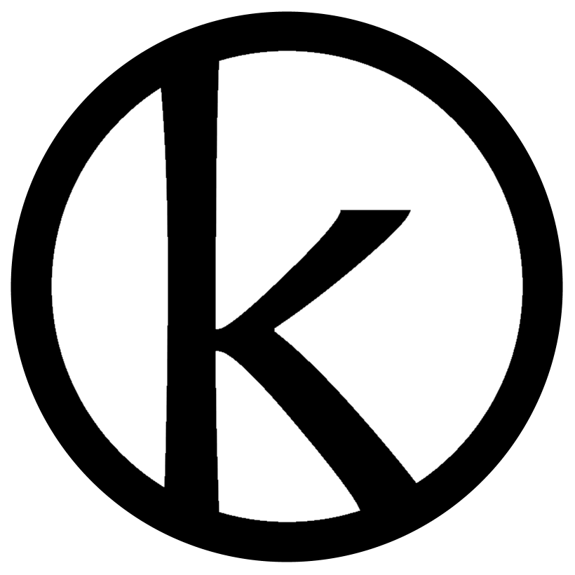
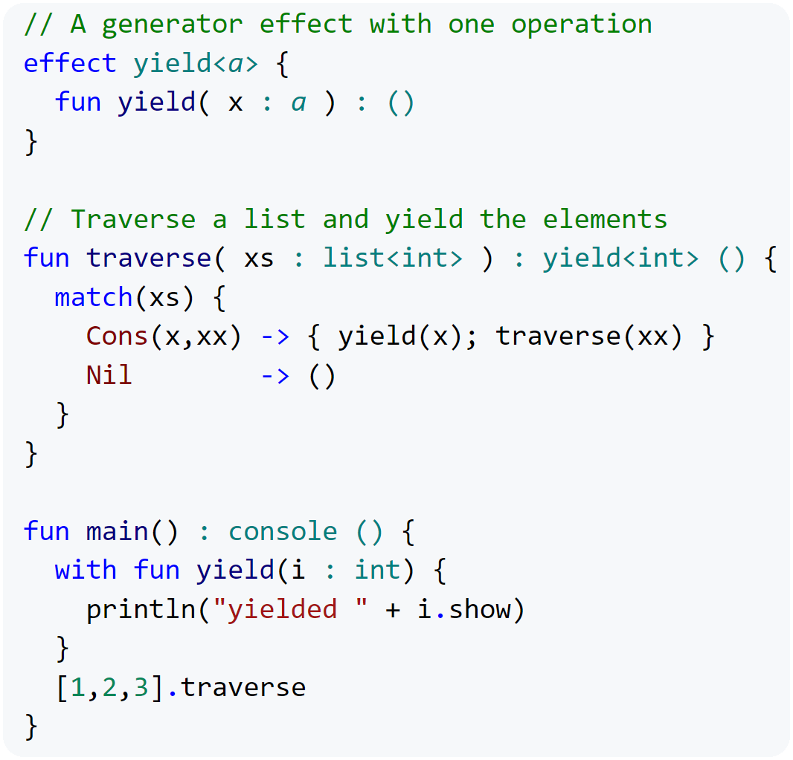
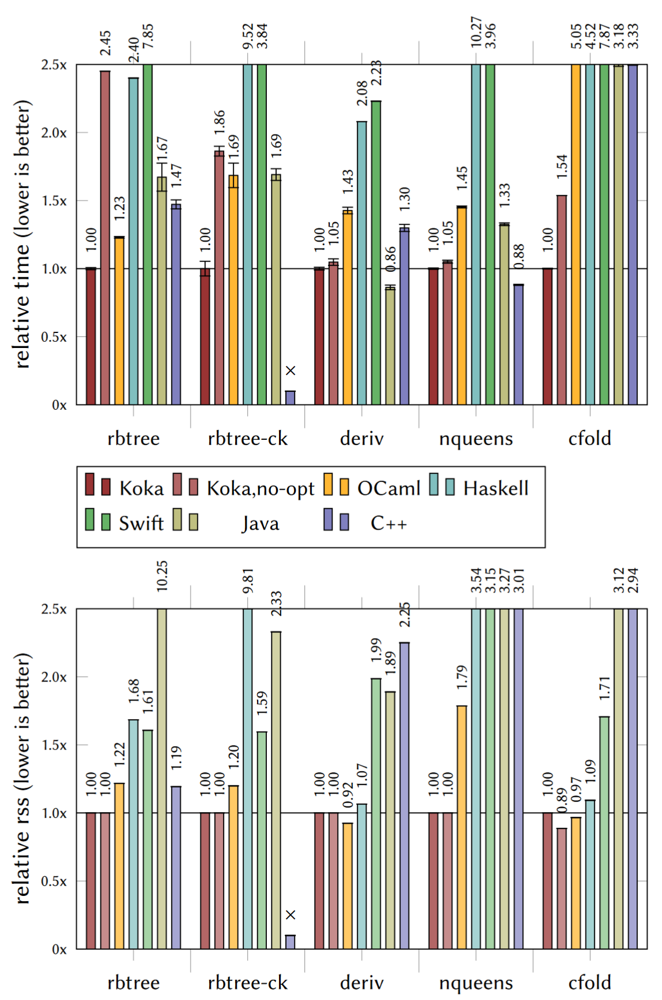

[](https://github.com/koka-lang/koka/actions/workflows/bundle.yaml)



<!--
[](https://travis-ci.org/koka-lang/koka)
-->

&nbsp;

# Koka: a Functional Language with Effects

_Koka v3 is a research language that is currently under development and not quite ready for production use_. 

_Latest release_: v3.2.3, 2026-03-17

 ([Install]).

<a href="https://koka-lang.github.io/koka/doc/book.html#why-handlers"></a>

Koka is a strongly typed functional-style language with effect types and handlers.

* The core of Koka consists of a small set of well-studied language features, like first-class functions,
  a polymorphic type- and effect system, algebraic data types, and effect handlers. Each of these is
  composable and avoid the addition of “special” extensions by being as general as possible.
* Koka tracks the (side) _effects_ of every
  function in its type, where pure and effectful computations are
  distinguished. The precise effect typing gives Koka _rock-solid
  semantics_ backed by well-studied category theory, which makes Koka
  particularly easy to reason about for both humans and compilers.
* _Effect handlers_ let you define advanced control abstractions,
  like exceptions, async/await, or probabilistic programs,
  as a user library in a typed and composable way.
* [Perceus](https://koka-lang.github.io/koka/doc/book.html#why-perceus) is an advanced compilation method for reference counting.
  Together with [evidence passing][evidence], this lets Koka compile directly to C code _without needing
  a garbage collector or runtime system_.
  Perceus also performs [reuse analysis](https://koka-lang.github.io/koka/doc/book.html#why-fbip) and optimizes
  functional-style programs to use in-place updates when possible.

To learn more:

* [Install] Koka and compile your first programs.
* Read the [Koka book][kokabook] for a tour of the Koka language and its specification.
* Browse the [library documentation][libraries].
* Help with [development](#tasks)

[why-mingen]: https://koka-lang.github.io/koka/doc/book.html#why-mingen
[why-effects]: https://koka-lang.github.io/koka/doc/book.html#why-effects
[why-handlers]: https://koka-lang.github.io/koka/doc/book.html#why-handlers
[why-perceus]: https://koka-lang.github.io/koka/doc/book.html#why-perceus
[why-fbip]: http://koka-lang.github.io/koka/doc/book.html#why-fbip

[install]: https://koka-lang.github.io/koka/doc/book.html
[why]: https://koka-lang.github.io/koka/doc/book.html#why
[kokabook]: https://koka-lang.github.io/koka/doc/book.html
[tour]: https://koka-lang.github.io/koka/doc/book.html#tour
[libraries]: https://koka-lang.github.io/koka/doc/toc.html
[slides]: http://research.microsoft.com/en-us/projects/koka/2012-overviewkoka.pdf
[kokarepo]: https://github.com/koka-lang/koka
[kokaproject]: http://research.microsoft.com/en-us/projects/koka

[evidence]: https://www.microsoft.com/en-us/research/publication/generalized-evidence-passing-for-effect-handlers/
[releases]: https://github.com/koka-lang/koka/releases
[build]: #build-from-source
[Perceus]: https://www.microsoft.com/en-us/research/publication/perceus-garbage-free-reference-counting-with-reuse/
[vsprompt]: https://docs.microsoft.com/en-us/cpp/build/how-to-enable-a-64-bit-visual-cpp-toolset-on-the-command-line?view=vs-2019
[winclang]: https://github.com/llvm/llvm-project/releases/latest
[vcpkg]: https://vcpkg.io/en/getting-started.html
[ghcup]: https://www.haskell.org/ghcup
[nobrace]: https://koka-lang.github.io/koka/doc/book.html#sec-layout
[m1arch]: https://cpufun.substack.com/p/setting-up-the-apple-m1-for-native
[bigint]: https://developer.mozilla.org/en-US/docs/Web/JavaScript/Reference/Global_Objects/BigInt
[emscripten]: https://emscripten.org/docs/getting_started/downloads.html
[musl]: https://musl.libc.org/
[wasmtime]: https://wasmtime.dev/
[fiptree-tr]: https://www.microsoft.com/en-us/research/uploads/prod/2023/07/fiptree-tr-v4.pdf
[whatsnew]: support/vscode/koka.language-koka/whatsnew.md

Enjoy,
  Daan Leijen

Special thanks to: [Tim Whiting](https://github.com/TimWhiting) and [Fredrik Wieczerkowski](https://github.com/fwcd)
for their work on the VS Code language integration,
[Anton Lorenzen](https://antonlorenzen.de/) for his work on one-hole context ([pdf][fiptree-tr]), fully in-place programming [[11](#references)] and frame-limited
reuse in Perceus [[10]](#references), [Ningning Xie](https://xnning.github.io/) for her work on the theory and practice of evidence passing [[9,6]](#references) and the formalization of Perceus reference counting [[8]](#references),
[Alex Reinking](https://alexreinking.com/) for the implementation of the Perceus reference counting analysis [[8]](#references),
and all previous interns working on earlier versions of Koka: Daniel Hillerström, Jonathan Brachthäuser, Niki Vazou, Ross Tate, Edsko de Vries, and Dana Xu.

## Recent Releases

See the [whatsnew][whatsnew] notes.

# Install

Koka has [binary installers][install] for Windows (x64), macOS (x64, M1), and Linux (x64) <!--, arm64), and FreeBSD (x64). -->
For other platforms, you need to build the compiler from source.

# Build from Source

Koka has few dependencies and should build from source
without problems on most common platforms, e.g. Windows (including WSL), macOS, and
Unix. The following programs are required to build Koka:

* [Stack](https://docs.haskellstack.org/) to run the Haskell compiler.
  Use `brew install haskell-stack` on macOS, `curl -sSL https://get.haskellstack.org/ | sh` on Unix,
  or the binary [installer](https://get.haskellstack.org/stable/windows-x86_64-installer.exe) on Windows.
* Optional: [vcpkg] to be able to link easily with C libraries.
  Use `brew install vcpkg` on macOS. On other systems use the vcpkg [install][vcpkg]
  instructions (Koka can find vcpkg automatically if installed to `~/vcpkg`).
* Optional: [nodejs](http://nodejs.org) if using the Javascript backend.
* Optional: [emscripten] and [wasmtime] if using the Wasm backend.
* Optional: On Windows it is recommended to install the [clang][winclang] C compiler (use `LLVM-<version>-win64.exe`), or the [Visual Studio](https://visualstudio.microsoft.com/downloads/) C compiler.
* On Windows, first set the console codepage to UTF8 to avoid build errors with stack: **`$ chcp 65001`**.

Now clone the repository and build the compiler as:

```sh
$ git clone --recursive https://github.com/koka-lang/koka
$ cd koka
$ stack update
$ stack build --fast
$ stack exec koka
```

(Note: if you forgot to pass `--recursive` on cloning, you will get errors when compiling Koka modules --
you can correct this by running `git submodule update --init --recursive`).

To run all tests, use `stack test --fast`. To run a single test you can run stack test 
filtering based on paths such as `stack test --fast --test-arguments="--match /lib"`.
This will run all tests that are under the `test/lib` directory.
On MacOS make sure that you're locale is C by running: `export LANG=C` prior to running the tests (otherwise you will get Haskell issues in some unicode tests).

You can also use `stack build` without the `--fast` flag to build an optimized version of the compiler.

(See the [build notes](#build-notes) below if you have issues when running- or installing `stack`).

## Create an Install Bundle

Koka can generate a binary install bundle that can be installed
on the local machine (use a build without `--fast` in that case):

```sh
$ stack build
$ stack exec koka -- -e util/bundle
...
distribution bundle created.
  bundle : bundle/<version>/koka-<version>-<platform>.tar.gz
  cc     : <compiler>
  version: <version>
```

This takes a while as it pre-compiles the standard libraries in three build
variants (`debug`, `drelease` (release with debug info), and `release`).
After generating the bundle, you can install it locally as:

```sh
$ util/install.sh  bundle/<version>/koka-<version>-<platform>
```

(use `util/install.bat` on Windows).
After installation, you can now directly invoke `koka`:

```sh
$ koka --version
```

Koka is by default installed for the current user in `<prefix>/bin/koka`,
(with architecture specific files under `<prefix>/lib/koka/v3.x.x`
and libraries and samples under `<prefix>/share/koka/v3.x.x`).
On Unix and macOS the default prefix is `/usr/local` while
on Windows the default prefix is `%LOCALAPPDATA%\koka`.

It is also possible to generate installation packages for
various Linux platforms (RHEL, Debian, Alpine, etc.). See
the [readme](util/packaging) for further information.

# Benchmarks

These are initial benchmarks of Koka v2 with [Perceus] reference counting
versus state-of-the-art memory reclamation implementations in
various other languages. Since we compare across languages we need to
interpret these results with care -- the results depend not only on memory
reclamation but also on the different optimizations performed by each
compiler and how well we can translate each benchmark to that particular
language. We view these results therefore mostly as _evidence that the
current Koka implementation of reference counting is viable and can be competitive_
and _not_ as a direct comparison of absolute performance between languages and systems.

As such, we select here only benchmarks that stress memory allocation, and
we tried to select mature comparison systems that use a range of memory
reclamation techniques and are considered best-in-class. The systems we
compare are, Koka 2.0.3 (compiling the generated C code with gcc 9.3.0),
[OCaml](https://ocaml.org) 4.08.1, [Haskell](https://www.haskell.org) GHC 8.6.5,
[Swift](https://swift.org/) 5.3, [Java](https://www.java.com) SE 15.0.1 with the Hotspot G1 collector,
and [C++](http://www.cplusplus.org) gcc 9.3.0.



The benchmarks are all available in [`test/bench`](test/bench) (see the
readme there for build instructions), and all
stress memory allocation with little computation:
`rbtree` (inserts 42 million items into a red-black tree),
`rbtree-ck` (a variant of `rbtree` that keeps a list of every 5th
subtree and thus shares many subtrees), `deriv`
(the symbolic derivative of a large expression),
`nqueens` (calculates all solutions for the n-queens problem of size 13
into a list, and returns the length of that list where the solution lists
share many sub-solutions), and `cfold` (constant-folding over a large symbolic expression).

Note: in C++, without automatic memory management, many benchmarks are
difficult to express directly as they use persistent and
partially shared data structures. To implement these faithfully would
essentially require manual reference counting. Instead, we use C++ as
our performance baseline: we either use in-place updates
without supporting persistence (as in `rbtree` which uses ``std::map``)
or we do not reclaim memory at all (as in `deriv`, `nqueens`, and `cfold`).

The execution times and peak working set averaged over 10 runs and normalized to Koka are in
the figure on the right (on a 3.8Ghz AMD3600XT on Ubuntu 20.04, Nov 2020).

We can see that even though Koka has currently few
optimizations besides the reference counting ones, it performs very well
compared to these mature systems, often outperforming by a significant
margin -- both in execution time and peak working set.
Clearly, these benchmarks are allocation heavy but it is encouraging
to see this initial performance from Koka.

A full discussion of these benchmarks and systems can be found
in the [Perceus] report.

# Tasks

Please help develop Koka: there are many opportunities to improve Koka or do research with Koka. We need:

* [ ] Emacs (partially done) and Vim syntax highlighting.
* [ ] Add more samples, improve documentation, landing page etc. Make it easier for people to contribute.
* [x] Run the full test suite.
* [x] Run the Bayesian probalistic machine learning program with large parameters.
* [x] Functions with a pattern match in the argument (by Steven Fontanella).
* [x] Support `int64` operations

More advanced projects:

* [x] Update the JavaScript backend to 1) use modern modules instead of amdefine, 2) use the new bigints instead of
  bigint.js, and 3) add support for int64. (landed in the `dev` branch)
* [x] Port `std/text/regex` from v1 (using PCRE)
* [x] Compile to WASM (using emscripten on the current C backend)
* [ ] Package management of Koka modules.
* [ ] Improve compilation of local state to use local variables directly (in C) without allocation. Tricky though due to multiple resumptions.
* [ ] Improve performance of array/mutable reference programming. Koka is has great performance for
      algebraic datatypes but lags when using more imperative array algorithms. This requires better
      integration with the reference counting (faster in-place update for vectors) and integration local mutable references.
* [ ] To support optimal Btree's we need _mutable fields_ in constructors, and perhaps intrusive vector fields.
* [ ] The current parallel task support is very basic; we need a great work-stealing thread pool, LVar's etc.
* [ ] Expose the "bytes" primitive data together with views..
* [ ] Improve C code generation by identifying output that could be better; also in effectful code we generate many join-points (see [9]),
      can we increase the sharing/reduce the extra code.
* [x] The compiler always analyses module dependencies and builds any needed dependencies. The current code
      (in `src/Compiler/Compile.hs`) is not great and it would be nice to factorize the "make" functionality out
      and also allow for parallel builds.

Master/PhD level:

* [x] Better language level FBIP support with guaranteed datatype matching, automatic derivative and visitor generation.
* [x] Float up `open` calls to improve effect handling (worked on by Naoya Furudono)
* [x] Formalize opening and closing effect row types (worked on by Kazuki Ikemori)
* [ ] Can we use C++ exceptions to implement "zero-cost" `if yielding() ...` branches and remove the need for join points (see [9]).
* [ ] Improve case-of-known simplification with shape information

Currently being worked on:

* [x] Various standard optimizations like case-of-case, join points, case-of-known constructor, etc.
* [x] Implement inline specialization where functions like `map`, `fold` etc get specialized for the function
  with which they are called. This is an important optimization for functional style languages to reduce the allocation of lambda's.
  (contact: Steven Fontanella)
* [x] Borrowing analysis for Perceus and improved reuse analysis. (contact: Anton Lorenzen)

The following is the immediate todo list to be completed in the coming months:

* [ ] Port `std/async` with `libuv` integration.
* [x] Initial support for overloading through implicit parameters.

LSP Related Tasks:
* [ ] Generate completions for effect handlers (with empty bodies of all the functions)
* [ ] Generate show / (==) for datatypes
* [ ] Find References

Contact me if you are interested in tackling some of these :-)

# Build Notes

## Branches

The main development branches are:
* `master`: latest stable version.
* `dev`: current development branch -- submit PR's to this branch.
* `v1-master`: last stable version of Koka v1: this is Koka with the Javascript (and C#)
  backend which does not use evidence translation.
  This version supports `std/async` and should compile examples from published papers.

## Building on macOS M1

You need at least `stack` version >= 2.11
Furthermore, you may need to add the `brew`
installed LLVM to your path afterwards, or otherwise stack cannot find the LLVM tools.
Add the following to your `~/.zshrc` script and open an fresh prompt:

```sh
export PATH=/opt/homebrew/opt/llvm/bin:$PATH
```

<!--
Moreover, sometimes `stack` segfaults but running it inside `bash` seems to resolve the issue.
Also, we need to tell stack to use the system installed ghc and skip the version check as
it can currently not install GHC for arm64 yet:
```
bash:~$ git clone --recursive https://github.com/koka-lang/koka
bash:~$ cd koka
bash:~/koka$ stack --system-ghc --skip-ghc-check build
bash:~/koka$ stack --system-ghc --skip-ghc-check exec koka
```

and pass the `--system-ghc` flag to create an installation bundle as well:
```
bash:~/koka$ stack --system-ghc --skip-ghc-check exec koka -- -e util/bundle -- --system-ghc
```
-->

## Building with Cabal

Some platforms (like Linux arm64 and FreeBSD) do not
always support `stack` well. In these cases we can also
use `ghc` and `cabal` directly. Install these packages as:

```sh
$ sudo apt update
$ sudo apt install ghc cabal-install
```

On macOS (x64 and arm64) we use `brew` instead:

```sh
$ brew install pkg-config ghc cabal-install
```

On FreeBSD, use `pkg`:

```sh
$ sudo pkg update
$ sudo pkg install ghc hs-cabal-install   # or: hs-haskell-platform
```

Optionally, install `vcpkg` as well. If you
install this in the `~/vcpkg` directory Koka will find
it automatically when needed:

```sh
~$ git clone https://github.com/microsoft/vcpkg
~$ ./vcpkg/bootstrap-vcpkg.sh
~$ vcpkg/vcpkg install pcre
```

We can now build the compiler using `cabal` as:

```sh
~$ git clone --recursive https://github.com/koka-lang/koka
~$ cd koka
~/koka$ cabal new-update
~/koka$ cabal new-build
~/koka$ cabal new-run koka
```

We can also run tests as:

```sh
~/koka$ cabal new-run koka-test
```

or create an installer:

```sh
~/koka$ cabal new-run koka -- -e util/bundle
```

## Building with minbuild

If neither `stack` nor `cabal` are functional, you may try to
run the minimal build script to build Koka:

```sh
~/koka$ ./util/minbuild.sh
```

which directly invokes `ghc` to build the compiler.
You can create an install bundle from a minbuild as:

```sh
~/koka$ .koka/minbuild/koka -e util/bundle.kk -- --koka=.koka/minbuild/koka
```

## Windows C Compilers

The Koka compiler on Windows requires a C compiler. By default
when using `stack exec koka` the C compiler supplied with `ghc` is used (`mingw`)
but that is only visible within a stack environmet.

It is therefore recommended to install the [clang][winclang] compiler for
Windows (which is automatically installed when running `util/install.bat`).
However, Koka can also use the Microsoft Visual C++ compiler (`cl`) if you
run `koka` from a [Visual Studio x64 toolset](vsprompt) command prompt (in
order to link correctly with the Windows system libraries).

Generally, for Koka code, `mingw` (`gcc`) optimizes best, closely followed `clang-cl`.
On a 3.8Gz AMD 3600XT, with `mingw` 7.2.0, `clang-cl` 11.0.0, and `cl` 19.28 we get:

```sh
$ stack exec out\v2.0.5\mingw-release\test_bench_koka_rbtree -- --kktime
420000
info: elapsed: 0.624s, user: 0.625s, sys: 0.000s, rss: 163mb

$ out\v2.0.5\clang-cl-release\test_bench_koka_rbtree --kktime
420000
info: elapsed: 0.727s, user: 0.734s, sys: 0.000s, rss: 164mb

$ out\v2.0.5\cl-release\test_bench_koka_rbtree --kktime
420000
info: elapsed: 1.483s, user: 1.484s, sys: 0.000s, rss: 164mb
```

## Profiling

Koka supports profiling with both GCC and Clang via the `--fprofile` flag.

### GCC (gprof — time-based sampling)

```sh
$ koka --fprofile -e myprogram.kk
$ gprof .koka/v*/gcc-profile-*/myprogram__main gmon.out
```

Shows where the program spends time (percentage of total, call counts per function).

### Clang (LLVM instrumentation — execution frequency)

```sh
$ koka --fprofile --cc=clang -e myprogram.kk
$ llvm-profdata merge -sparse default.profraw -o default.profdata
$ llvm-profdata show --all-functions --topn=15 default.profdata
```

Shows how often each function and code path executes.

### Linux perf (hardware sampling)

On Linux, `perf` provides hardware-accurate sampling on any compiled binary
— no special compiler flags are needed:

```sh
$ koka -O2 myprogram.kk
$ perf record -g .koka/v*/gcc-drelease-*/myprogram__main
$ perf report
```

Or generate a flame graph:

```sh
$ perf script | stackcollapse-perf.pl | flamegraph.pl > flame.svg
```

### Profiling utility

A convenience script automates the GCC compile-run-report workflow:

```sh
$ koka util/profile.kk -- myprogram.kk --runs=3 --opt=-O2
```

Run `koka util/profile.kk -- --help` for all options.

> **Note:** GCC profiling requires `gcc` and `gprof`.
> Clang profiling requires `clang` and `llvm-profdata`.
> Linux perf requires the `linux-tools` package.

## Language Server

See the [`support/vscode/README.md`](support/vscode/README.md) for how to
build the VS Code language server.


# References

1. Daniel Hillerström, and Sam Lindley. &ldquo;Liberating Effects with Rows and Handlers.&rdquo; In _Proceedings of the 1st International Workshop on Type-Driven Development_, 15--27. TyDe 2016. Nara, Japan. 2016. doi:[10.1145/2976022.2976033](https://dx.doi.org/10.1145/2976022.2976033).

2. Daan Leijen. &ldquo;Koka: Programming with Row Polymorphic Effect Types.&rdquo; In _Mathematically Structured Functional Programming 2014_. EPTCS. Mar. 2014. arXiv:[1406.2061](http://arxiv.org/abs/1406.2061).

3. Daan Leijen. _Algebraic Effects for Functional Programming_. MSR-TR-2016-29. Microsoft Research. Aug. 2016. <https://www.microsoft.com/en-us/research/publication/algebraic-effects-for-functional-programming>. Extended version of [4].

4. Daan Leijen. &ldquo;Type Directed Compilation of Row-Typed Algebraic Effects.&rdquo; In _Proceedings of Principles of Programming Languages (POPL’17)_. Paris, France. Jan. 2017.

5. Nicolas Wu, Tom Schrijvers, and Ralf Hinze. &ldquo;Effect Handlers in Scope.&rdquo; In _Proceedings of the 2014 ACM SIGPLAN Symposium on Haskell_, 1--12. Haskell ’14. ACM, New York, NY, USA. 2014. doi:[10.1145/2633357.2633358](https://dx.doi.org/10.1145/2633357.2633358)

6. Ningning Xie, Jonathan Brachthäuser, Daniel Hillerström, Philipp Schuster, Daan Leijen. &ldquo;Effect Handlers, Evidently&rdquo;
The 25th ACM SIGPLAN International Conference on Functional Programming (ICFP), August 2020. doi:[10.1145/3408981](https://doi.org/10.1145/3408981), [pdf](https://www.microsoft.com/en-us/research/uploads/prod/2020/07/evidently-with-proofs-5f0b7d860b387.pdf). See also [9] which improves upon this work.

7. Ningning Xie and Daan Leijen. &ldquo;Effect Handlers in Haskell, Evidently&rdquo; The 13th ACM SIGPLAN International Haskell Symposium, August 2020.
[pdf](https://www.microsoft.com/en-us/research/uploads/prod/2020/07/effev.pdf)
See also the [Ev.Eff](https://github.com/xnning/EvEff) and [Mp.Eff](https://github.com/xnning/MpEff) repositories.

8. Alex Reinking, Ningning Xie, Leonardo de Moura, and Daan Leijen: &ldquo; Perceus: Garbage Free Reference Counting with Reuse&rdquo; MSR-TR-2020-42, Nov 22, 2020. Distinguished paper at PLDI'21.
[pdf](https://www.microsoft.com/en-us/research/publication/perceus-garbage-free-reference-counting-with-reuse/)

9. Ningning Xie and Daan Leijen. &ldquo; Generalized Evidence Passing for Effect Handlers&rdquo; In The 26th ACM SIGPLAN International Conference on Functional Programming (ICFP), August 2021.
Also as MSR-TR-2021-5, Mar, 2021.
[pdf](https://www.microsoft.com/en-us/research/publication/generalized-evidence-passing-for-effect-handlers/)

10. Anton Lorenzen and Daan Leijen. &ldquo; Reference Counting with Frame-Limited Reuse&rdquo; Microsoft Research
technical report MSR-TR-2021-30, Nov 2021, (updated Mar 2022, v2). [pdf](https://www.microsoft.com/en-us/research/publication/reference-counting-with-frame-limited-reuse-extended-version/)

11. Anton Lorenzen, Daan Leijen, and Wouter Swierstra. &ldquo;FP<sup>2</sup>: Fully in-Place Functional Programming&rdquo;
The 28th ACM SIGPLAN International Conference on Functional Programming (ICFP), September 2023.
[pdf](https://www.microsoft.com/en-us/research/uploads/prod/2023/05/fbip.pdf) (extended tech. report MSR-TR-2023-19, May 2023).
