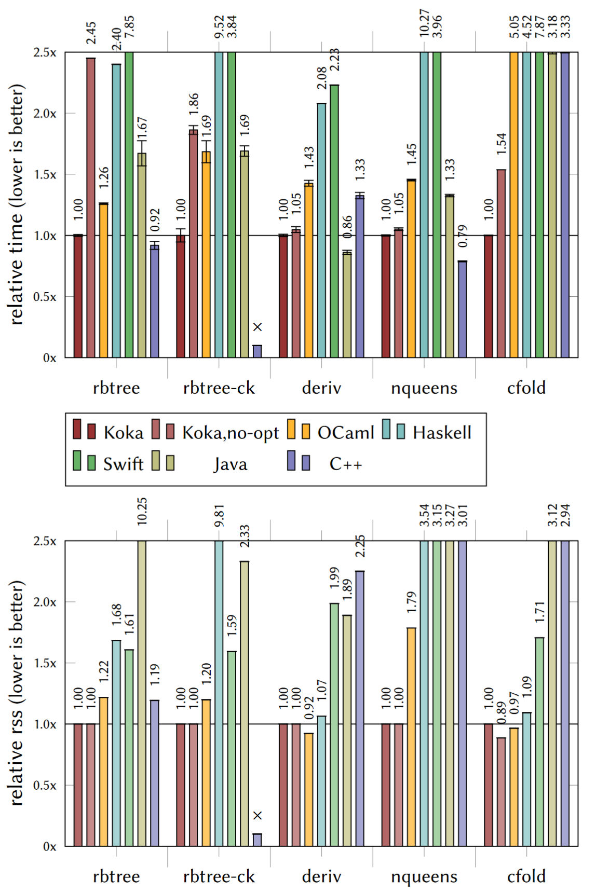

<!--
[](https://travis-ci.org/koka-lang/koka)
-->
[](https://gitter.im/koka-lang/koka?utm_source=badge&utm_medium=badge&utm_campaign=pr-badge&utm_content=badge)

&nbsp;

# Koka: a Functional Language with Effects

_Koka v2 is a research language that currently under heavy development with the new C backend_  
_Latest release_: v2.1.6, 2021-06-10 ([Install]).

<a href="https://koka-lang.github.io/koka/doc/book.html#why-handlers"></a>

Koka is a strongly typed functional-style language with effect types and handlers.

* The core of Koka consists of a small set of well-studied language features, like first-class functions, 
  a polymorphic type- and effect system, algebraic data types, and effect handlers. Each of these is 
  composable and avoid the addition of “special” extensions by being as general as possible. 
* Koka tracks the (side) _effects_ of every
  function in its type, where pure and effectful computations are
  distinguished. The precise effect typing gives Koka _rock-solid
  semantics_ backed by well-studied category theory, which makes Koka
  particularly easy to reason about for both humans and compilers.  
* _Effect handlers_ let you define advanced control abstractions,
  like exceptions, async/await, or probabilistic programs, 
  as a user library in a typed and composable way.
* [Perceus](https://koka-lang.github.io/koka/doc/book.html#why-perceus) is an advanced compilation method for reference counting.
  Together with [evidence passing][evidence], this lets Koka compile directly to C code _without needing
  a garbage collector or runtime system_. 
  Perceus also performs [reuse analysis](https://koka-lang.github.io/koka/doc/book.html#why-fbip) and optimizes
  functional-style programs to use in-place updates when possible.

To learn more:

* [Install] Koka and compile your first programs. 
* Read the [Koka book][kokabook] for a tour of the Koka language and its specification.
* Browse the [library documentation][libraries].
* Help with [development](#tasks)


[why-mingen]: https://koka-lang.github.io/koka/doc/book.html#why-mingen
[why-effects]: https://koka-lang.github.io/koka/doc/book.html#why-effects
[why-handlers]: https://koka-lang.github.io/koka/doc/book.html#why-handlers
[why-perceus]: https://koka-lang.github.io/koka/doc/book.html#why-perceus
[why-fbip]: http://koka-lang.github.io/koka/doc/book.html#why-fbip

[install]: https://koka-lang.github.io/koka/doc/book.html#install
[why]: https://koka-lang.github.io/koka/doc/book.html#why
[kokabook]: https://koka-lang.github.io/koka/doc/book.html  
[tour]: https://koka-lang.github.io/koka/doc/book.html#tour
[libraries]: https://koka-lang.github.io/koka/doc/toc.html
[slides]: http://research.microsoft.com/en-us/projects/koka/2012-overviewkoka.pdf
[kokarepo]: https://github.com/koka-lang/koka
[kokaproject]: http://research.microsoft.com/en-us/projects/koka

[evidence]: https://www.microsoft.com/en-us/research/publication/generalized-evidence-passing-for-effect-handlers/
[releases]: https://github.com/koka-lang/koka/releases
[build]: #build-from-source
[Perceus]: https://www.microsoft.com/en-us/research/publication/perceus-garbage-free-reference-counting-with-reuse/
[vsprompt]: https://docs.microsoft.com/en-us/cpp/build/how-to-enable-a-64-bit-visual-cpp-toolset-on-the-command-line?view=vs-2019
[winclang]: https://llvm.org/builds
[vcpkg]: https://github.com/microsoft/vcpkg#getting-started

Enjoy,  
  Daan Leijen

Special thanks to: [Ningning Xie](https://xnning.github.io/) for her work on the theory and practice of evidence passing [[9,6]](#references) and the formalization of Perceus reference counting [[8]](#references),
[Alex Reinking](https://alexreinking.com/) for the implementation of the Perceus reference counting analysis [[8]](#references),
and all previous interns working on earlier versions of Koka: Daniel Hillerström, Jonathan Brachthäuser, Niki Vazou, Ross Tate, Edsko de Vries, and Dana Xu.

## Releases

- `v2.1.6`, 2021-06-10: initial support for shallow resumptions, fix space leak with vectors, allow `gcc` with `--fasan`,
  improved `vcpkg` support, add `--fstdalloc` flag, improved VS code syntax highlighting, improved `valgrind` support,
  added `--no-optimize` flag for extended debug information.
- `v2.1.4`, 2021-05-31: remove dependency on cmake, support library linking, support vckpg, updated `std/text/regex`,
  improved Windows installer with `clang` install included, remove dependency on Visual Studio on Windows,
  improved `--fasan` support, fixed space leak on boxed value types, use signed `size_t` internally, various small bug fixes.
- `v2.1.2`, 2021-05-01: various bug fixes, allow pattern bindings in parameters of anonymous functions (by Steven Fontanella),
  initial Emacs syntax highlighting (by Kamoii).
- `v2.1.1`, 2021-03-08: bug fixes, use right-associative (++) for string- and list append (instead of (+)), improved internal 
  string handling.
- `v2.0.16`, 2021-02-14: bug fixes, fix short-circuit evaluation of logical operations, improved utf-8 handling.
- `v2.0.14`, 2020-12-11: bug fixes, improved var escape checking.
- `v2.0.12`, 2020-12-02: syntax highlighting support for VS Code and Atom, improved uninstall, more samples.
- `v2.0.9`, 2020-11-27: now with binary [releases] for Windows, macOS, and Linux.
- `v2.0.7`, 2020-11-23: more small fixes, improved scoped handlers, improved higher-rank type propagation, more samples.
- `v2.0.5`, 2020-11-15: many bug fixes and improvements. Improved codegen, named handlers, added samples, docker support, direct C 
  compilation, local install support.
- `v2.0.0`, 2020-08-21: initial v2 release.

<!--

-->

# Install

Koka has [binary installers][install] for Windows (x64), macOS (x64), and Linux (x64,arm64).
For other platforms, you need to build the compiler from source.

# Build from Source

Koka has few dependencies and should build from source
without problems on most common platforms, e.g. Windows (including WSL), macOS, and
Unix. The following programs are required to build Koka:

* [Stack](https://docs.haskellstack.org/) to run the Haskell compiler.  
  Use `curl -sSL https://get.haskellstack.org/ | sh` on Unix and macOS, or the binary [installer](https://get.haskellstack.org/stable/windows-x86_64-installer.exe) on Windows.
* Optional components: 
  - [vcpkg] to be able to link easily with C libraries:  
    `$ git clone https://github.com/microsoft/vcpkg`  
    `$ ./vcpkg/bootstrap-vcpkg.sh` &nbsp; (or `.\vcpkg\bootstrap-vcpkg.bat` on Windows)
  - [nodejs](http://nodejs.org) if using the Javascript backend.
  - On Windows it is recommended to install the [clang][winclang] C compiler, or the [Visual Studio](https://visualstudio.microsoft.com/downloads/) C compiler.

Now clone the repository and build the compiler (note the `--recursive` flag):
```
$ git clone --recursive https://github.com/koka-lang/koka
$ cd koka
$ stack build
$ stack exec koka
```
You can also use `stack build --fast` to build a debug version of the compiler.


## Installing Stack 

On less common platforms (like `arm64`), the default installation method for `stack` (and `ghc`) may fail.
The following instructions work for Linux on arm64 (tested on a graviton2 AWS instance with Ubuntu 20.04).
First install `ghc`, `cabal`, and `stack` as packages:
```
$ sudo apt update
$ sudo apt install alex ghc cabal-install haskell-stack
$ stack update
```
Optionally, install `vcpkg` as well:
```
$ git clone https://github.com/microsoft/vcpkg
$ ./vcpkg/bootstrap-vcpkg.sh
$ export VCPKG_FORCE_SYSTEM_BINARIES=1
```
We can now build the Koka compiler by explicitly using the system
ghc, and optionally giving an older
[resolver](https://www.stackage.org/) that matches our ghc version:
```
$ git clone --recursive https://github.com/koka-lang/koka
$ cd koka
$ stack --resolver lts-14.27 --system-ghc build
$ stack --resolver lts-14.27 --system-ghc exec koka
```
Instead of specifying this on the command line, 
you can also set the resolver explicitly in the `stack.yaml` file
and uncomment the line `system-ghc: true`.

If you still find yourself unable to run `stack`, you may try to 
just install `ghc` and `alex` and run the minimal build script as
`./util/minbuild.sh`.

## Create an Install Bundle

Koka can generate a binary install bundle that can be installed
on the local machine:
```
$ stack exec koka -- util/bundle
...
distribution bundle created.
  bundle : dist/koka-v2.1.7-linux-x64.tar.gz
  cc     : gcc
  version: v2.1.7
```
This takes a while as it pre-compiles the standard libraries in three build
variants (`debug`, `drelease` (release with debug info), and `release`).
After generating the bundle, you can install it locally as:
```
$ util/install.sh -b dist/koka-v2.1.7-linux-x64.tar.gz
```
(use `util/install.bat` on Windows). 
After installation, you can now directly invoke `koka`:
```
$ koka --version
```
Koka is by default installed for the current user in `<prefix>/bin/koka`,
(with architecture specific files under `<prefix>/lib/koka/v2.x.x`
and libraries and samples under `<prefix>/share/koka/v2.x.x`).
On Windows the default prefix is `%APPDATA%\local` (which is also
used by `stack`).


# Benchmarks

These are initial benchmarks of Koka v2 with [Perceus] reference counting
versus state-of-the-art memory reclamation implementations in
various other languages. Since we compare across languages we need to
interpret these results with care -- the results depend not only on memory
reclamation but also on the different optimizations performed by each
compiler and how well we can translate each benchmark to that particular
language. We view these results therefore mostly as _evidence that the
current Koka implementation of reference counting is viable and can be competitive_
and _not_ as a direct comparison of absolute performance between languages and systems.

As such, we select here only benchmarks that stress memory allocation, and
we tried to select mature comparison systems that use a range of memory
reclamation techniques and are considered best-in-class. The systems we
compare are, Koka 2.0.3 (compiling the generated C code with gcc 9.3.0),
[OCaml](https://ocaml.org) 4.08.1, [Haskell](https://www.haskell.org) GHC 8.6.5,
[Swift](https://swift.org/) 5.3, [Java](https://www.java.com) SE 15.0.1 with the Hotspot G1 collector,
and [C++](http://www.cplusplus.org) gcc 9.3.0.



The benchmarks are all available in [`test/bench`](test/bench) (see the
readme there for build instructions), and all
stress memory allocation with little computation:
`rbtree` (inserts 42 million items into a red-black tree),
`rbtree-ck` (a variant of `rbtree` that keeps a list of every 5th
subtree and thus shares many subtrees), `deriv`
(the symbolic derivative of a large expression),
`nqueens` (calculates all solutions for the n-queens problem of size 13
into a list, and returns the length of that list where the solution lists
share many sub-solutions), and `cfold` (constant-folding over a large symbolic expression).

Note: in C++, without automatic memory management, many benchmarks are
difficult to express directly as they use persistent and
partially shared data structures. To implement these faithfully would
essentially require manual reference counting. Instead, we use C++ as
our performance baseline: we either use in-place updates
without supporting persistence (as in `rbtree` which uses ``std::map``)
or we do not reclaim memory at all (as in `deriv`, `nqueens`, and `cfold`).

The execution times and peak working set averaged over 10 runs and normalized to Koka are in
the figure on the right (on a 3.8Ghz AMD3600XT on Ubuntu 20.04, Nov 2020).

We can see that even though Koka has currently few
optimizations besides the reference counting ones, it performs very well
compared to these mature systems, often outperforming by a significant
margin -- both in execution time and peak working set.
Clearly, these benchmarks are allocation heavy but it is encouraging
to see this initial performance from Koka.

A full discussion of these benchmarks and systems can be found
in the [Perceus] report.


# Tasks

Please help develop Koka: there are many opportunities to improve Koka or do research with Koka. We need:

- Emacs (partially done) and Vim syntax highlighting.
- Improve documentation, landing page etc. Make it easier for people to contribute.
- More examples
- Many library modules are incomplete (like `std/os/file`) or missing (like `std/data/map`).

More advanced projects:

- Update the JavaScript backend to 1) use proper modules instead of amdefine, 2) use the new bigints instead of 
  bigint.js, and 3) add support for int64. This requires mostly changes to `Backend/JS/FromCore.hs` together 
  with `lib/core/core-inline.js`.
- Partially done: see PR #100. A language server for Visual Studio Code and Atom. Koka can already generate a 
  typed [range map](src/Syntax/RangeMap.hs) so this should be managable.
- Package management of Koka modules.
- Proper overloading with (a form of) type classes. (in design phase).

Currently being worked on:

- Various standard optimizations like case-of-case, join points, case-of-known constructor, etc.
- Implement inline specialization where functions like `map`, `fold` etc get specialized for the function 
  with which they are called.
  This is an important optimization for functional style languages to reduce the allocation of lambda's.
  (contact: Steven Fontanella)
- Borrowing analysis for Perceus and improved reuse analysis. (contact: Anton Lorenzen)


The following is the immediate todo list to be completed in the coming months:

- Port `std/async` (using `libuv`).
- Improve compilation of local state to use local variables directly (in C).

Contact me if you are interested in tackling some of these :-)

Main branches:
- `master`: latest stable version.
- `dev`: current development branch -- submit PR's to this branch.
- `v1-master`: last stable version of Koka v1: this is Koka with the Javascript (and C#) backend which does not use evidence translation.
               This version supports `std/async` and should compile examples from published papers.

Recently completed tasks:

- Ported `std/text/regex` (using PCRE)
- Run the full test suite.
- Run the Bayesian probalistic machine learning program with large parameters.
- Functions with a pattern match in the argument (by Steven Fontanella).


## Windows C Compilers.

The Koka compiler on Windows requires a C compiler. By default
when using `stack exec koka` the C compiler supplied with `ghc` is used (`mingw`)
but that is only visible within a stack environmet.

It is therefor recommended to install the [clang][winclang] compiler for
Windows (which is automatically installed when running `util/install.bat`).
However, Koka can also use the Microsoft Visual C++ compiler (`cl`) if you 
run `koka` from a [Visual Studio x64 toolset](vsprompt) command prompt (in 
order to link correctly with the Windows system libraries).

Generally, for Koka code, `mingw` (`gcc`) optimizes best, closely followed `clang-cl`.
On a 3.8Gz AMD 3600XT, with `mingw` 7.2.0, `clang-cl` 11.0.0, and `cl` 19.28 we get:
```
$ stack exec out\v2.0.5\mingw-release\test_bench_koka_rbtree -- --kktime
420000
info: elapsed: 0.624s, user: 0.625s, sys: 0.000s, rss: 163mb

$ out\v2.0.5\clang-cl-release\test_bench_koka_rbtree --kktime
420000
info: elapsed: 0.727s, user: 0.734s, sys: 0.000s, rss: 164mb

$ out\v2.0.5\cl-release\test_bench_koka_rbtree --kktime
420000
info: elapsed: 1.483s, user: 1.484s, sys: 0.000s, rss: 164mb
```


# References

1. Daniel Hillerström, and Sam Lindley. &ldquo;Liberating Effects with Rows and Handlers.&rdquo; In _Proceedings of the 1st International Workshop on Type-Driven Development_, 15--27. TyDe 2016. Nara, Japan. 2016. doi:[10.1145/2976022.2976033](https://dx.doi.org/10.1145/2976022.2976033).

2. Daan Leijen. &ldquo;Koka: Programming with Row Polymorphic Effect Types.&rdquo; In _Mathematically Structured Functional Programming 2014_. EPTCS. Mar. 2014. arXiv:[1406.2061](http://arxiv.org/abs/1406.2061).

3. Daan Leijen. _Algebraic Effects for Functional Programming_. MSR-TR-2016-29. Microsoft Research. Aug. 2016. <https://www.microsoft.com/en-us/research/publication/algebraic-effects-for-functional-programming>. Extended version of [4].

4. Daan Leijen. &ldquo;Type Directed Compilation of Row-Typed Algebraic Effects.&rdquo; In _Proceedings of Principles of Programming Languages (POPL’17)_. Paris, France. Jan. 2017.

5. Nicolas Wu, Tom Schrijvers, and Ralf Hinze. &ldquo;Effect Handlers in Scope.&rdquo; In _Proceedings of the 2014 ACM SIGPLAN Symposium on Haskell_, 1--12. Haskell ’14. ACM, New York, NY, USA. 2014. doi:[10.1145/2633357.2633358](https://dx.doi.org/10.1145/2633357.2633358)

6. Ningning Xie, Jonathan Brachthäuser, Daniel Hillerström, Philipp Schuster, Daan Leijen. &ldquo;Effect Handlers, Evidently&rdquo;
The 25th ACM SIGPLAN International Conference on Functional Programming (ICFP), August 2020. doi:[10.1145/3408981](https://doi.org/10.1145/3408981), [pdf](https://www.microsoft.com/en-us/research/uploads/prod/2020/07/evidently-with-proofs-5f0b7d860b387.pdf). See also [9] which improves upon this work.

7. Ningning Xie and Daan Leijen. &ldquo;Effect Handlers in Haskell, Evidently&rdquo; The 13th ACM SIGPLAN International Haskell Symposium, August 2020.
[pdf](https://www.microsoft.com/en-us/research/uploads/prod/2020/07/effev.pdf)
See also the [Ev.Eff](https://github.com/xnning/EvEff) and [Mp.Eff](https://github.com/xnning/MpEff) repositories.

8. Alex Reinking, Ningning Xie, Leonardo de Moura, and Daan Leijen: &ldquo; Perceus: Garbage Free Reference Counting with Reuse&rdquo; MSR-TR-2020-42, Nov 22, 2020. Distinguished paper at PLDI'21.
[pdf](https://www.microsoft.com/en-us/research/publication/perceus-garbage-free-reference-counting-with-reuse/)

9. Ningning Xie and Daan Leijen: &ldquo; Generalized Evidence Passing for Effect Handlers&rdquo; MSR-TR-2021-5, Mar, 2021. 
[pdf](https://www.microsoft.com/en-us/research/publication/generalized-evidence-passing-for-effect-handlers/)
